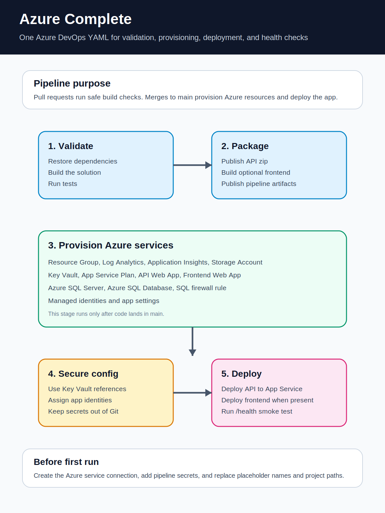

# Azure_Complete

A complete Azure DevOps starter repository for provisioning Azure services, validating pull requests, building application artifacts, and deploying after pull request acceptance into `main`.

## Infographic



## Thread captured in this README

### Request 1

> Can you create one YAML file that goes through the entire process of setting up all of the Azure services and does builds on PR acceptance. Comment every single Azure process with important setup details.

### Result

A heavily commented Azure DevOps pipeline was created. It is stored in this repository as:

```text
azure-pipelines.yml
```

The pipeline covers:

- PR validation builds
- Post-merge builds after PR acceptance into `main`
- Azure Resource Group provisioning
- Log Analytics setup
- Application Insights setup
- Storage Account setup
- Key Vault setup
- Linux App Service Plan setup
- API Web App setup
- Web Frontend App setup
- Azure SQL Server setup
- Azure SQL Database setup
- SQL firewall setup
- Managed identity setup
- Key Vault RBAC assignments
- App settings and Key Vault references
- API deployment
- Optional frontend deployment
- `/health` smoke testing
- `README.md`
- `azure-pipelines.yml`
- `azure-complete-infographic.svg`

### Request 4

> can you create an infogram of what the azure file does and upload that as well

### Result

An SVG infographic was added to visually explain the pipeline flow.

## Required Azure DevOps setup

Before the pipeline can run, configure these items in Azure DevOps:

1. Create an Azure Resource Manager service connection.
2. Prefer workload identity federation over stored client secrets.
3. Give the service connection Contributor access to the subscription or target resource group.
4. Create secret pipeline variables:
   - `sqlAdminUser`
   - `sqlAdminPassword`
5. Replace these placeholder values in `azure-pipelines.yml`:
   - `azureServiceConnection`
   - `subscriptionId`
   - `appPrefix`
   - `apiProjectPath`
   - `webProjectPath`

## Pull request build validation note

For GitHub or Bitbucket Cloud repos connected to Azure Pipelines, the YAML `pr:` trigger validates pull requests.

For Azure Repos Git, configure PR build validation through branch policies:

```text
Project Settings -> Repositories -> your repo -> Policies -> main -> Build validation
```

## Files

```text
README.md
azure-pipelines.yml
azure-complete-infographic.svg
```
